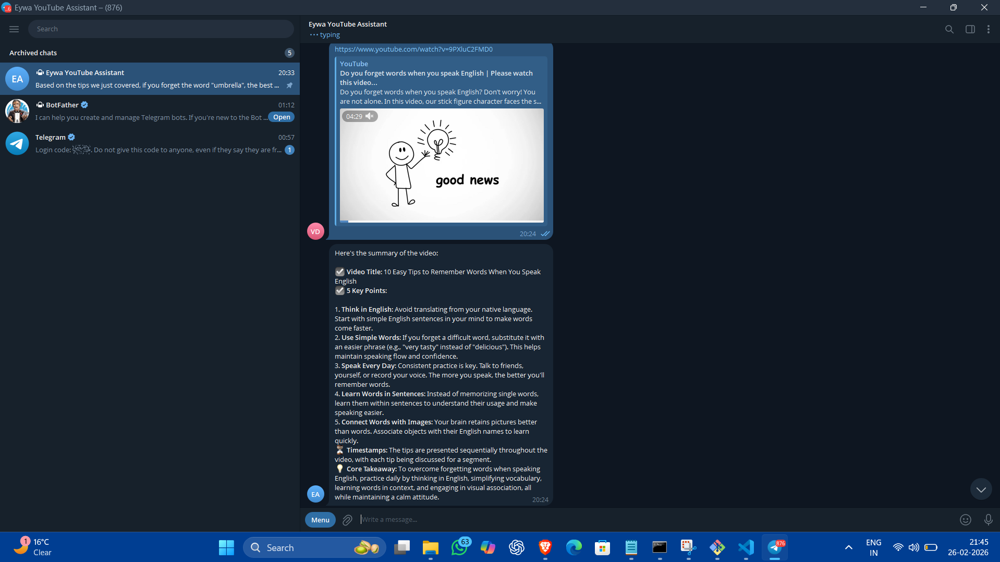
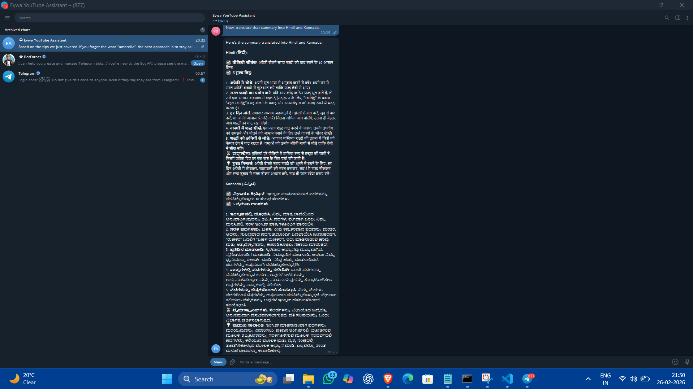

# 🤖 Eywa YouTube Research Assistant

A Telegram-based AI assistant designed to summarize YouTube videos and provide grounded, contextual Q&A using **OpenClaw** and **Gemini-2.5-flash**.

## 🏗️ System Architecture
The system utilizes a local gateway orchestrator and a custom transcript retrieval tool to ensure high accuracy and zero hallucinations:
* **Orchestrator**: OpenClaw Gateway (Local Server Environment).
* **Reasoning Engine**: Google Gemini-2.5-flash for natural language processing and translation.
* **Core Tool**: Custom Python script (`fetch_transcript.py`) utilizing `youtube-transcript-api`.


## 🌟 Key Features
* **Structured Summaries**: Automatic generation of Title, 5 Key Points, and a Core Takeaway.
* **Contextual Q&A**: Answers specific user questions based strictly on video transcript data.
* **Multilingual Support**: High-fidelity summaries and Q&A in **English, Hindi, and Kannada**.
* **Self-Healing Logic**: Automated UTF-8 stream reconfiguration to handle non-English character sets without encoding errors.

## 🛠️ Design Trade-offs & Decisions
* **Local Gateway Deployment**: Chose a local server setup to maintain low latency and eliminate hosting costs while proving functionality for the internship demo.
* **Scripted Transcript Retrieval**: Implemented a standalone Python script for transcript fetching instead of generic web search to enforce strict grounding and prevent LLM hallucinations.

## ⚙️ Setup & Installation
1. **Clone the repository**:
   ```bash
   git clone [https://github.com/Varun2045/Eywa-Youtube-Assistant.git](https://github.com/Varun2045/Eywa-Youtube-Assistant.git)


2. **Install necessary dependencies**:
```bash
pip install youtube-transcript-api

```


3. **Configure the Environment**:
* Open `openclaw.json` and insert your unique Telegram Bot Token.
* Ensure `AGENTS.md` is present in your workspace directory to define the bot's persona.


4. **Run the Assistant**:
```bash
openclaw gateway run

```


## 📸 Demo Screenshots

### 1. Automated Summarization

**Description**: When a YouTube link is received, the assistant executes the core tool to generate a title, 5 key points, and a core takeaway.

The output is formatted with:

* ☑ **Video Title**
* ☑ **5 Key Points**
* ⏳ **Timestamps**
* 💡 **Core Takeaway**


### 2. Multilingual Support

**Description**: Demonstration of the assistant translating the generated summary into Hindi and Kannada.


---

*Developed as part of the Eywa SDE Internship Technical Assessment.*

